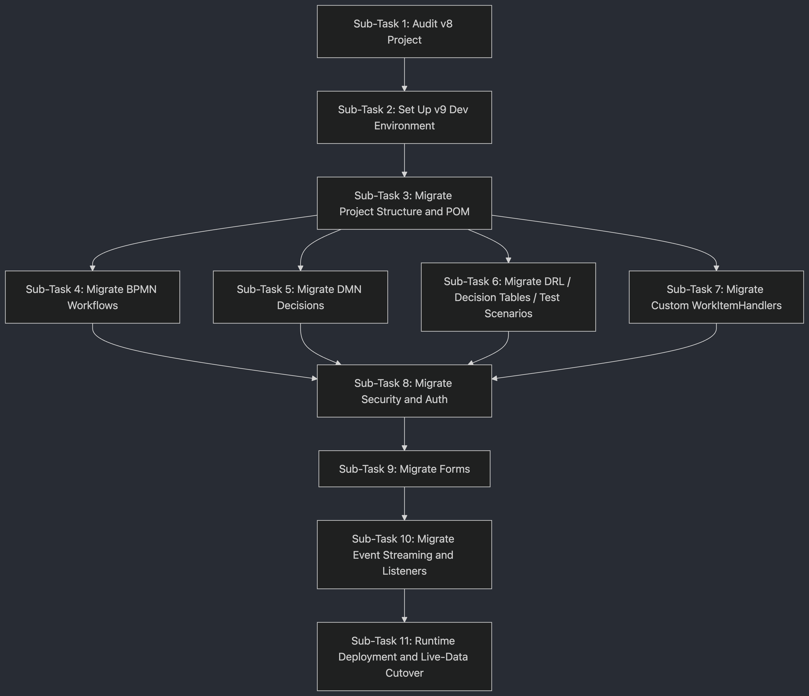

# BAMOE v8 → v9.5 Migration Workspace

This workspace contains everything needed to migrate an IBM Business Automation
Manager Open Editions (BAMOE) project from **v8.0.x** to **v9.5** (latest).

It pairs a structured 10-sub-task migration plan with a purpose-built Bob mode
(**BAMOE Migrator**) that executes every step grounded against the official
BAMOE 9.5.x documentation — fetching the exact doc page before touching any file.

---

## Workspace folder structure

```
bamoe_project_migrator/
│
├── v8-projects/                  # Exported v8 Business Central project(s)
│   └── <your-project>/           #   Read-only reference — never modify
│
├── v9-projects/                  # Migrated v9 Kogito / Quarkus project(s)
│   └── <your-project>/           #   Active build target
│
├── migration-workspace/          # Migration process artefacts (not shipped code)
│   ├── audit/                    #   Sub-Task 1 output: migration-inventory.md
│   │                             #     classifying every v8 asset
│   ├── docs/                     #   Working notes: decisions, mapping tables,
│   │                             #     per-sub-task findings
│   └── scripts/                  #   One-off helper scripts: scan for incompatible
│                                 #     patterns, batch-rename files, etc.
│
├── docs/                         # Permanent project documentation for the v9 service
│
├── demos/                        # Demo projects, sample payloads, Canvas / Developer
│                                 #   Tools examples
│
├── .bob/
│   └── custom_modes.yaml         # BAMOE Migrator Bob mode definition
│
├── bamoe-v8-to-v9-migration-plan.md   # The structured 10-sub-task migration plan
└── README.md                          # This file
```

### Folder purposes at a glance

| Folder | Role | Touch during migration? |
|---|---|---|
| `v8-projects/` | Original exported v8 project — read-only reference | No |
| `v9-projects/` | Migrated v9 project — active development target | Yes |
| `migration-workspace/audit/` | `migration-inventory.md` from Sub-Task 1 | Yes (Sub-Task 1) |
| `migration-workspace/docs/` | Working notes, decision log, mapping tables | Yes (any sub-task) |
| `migration-workspace/scripts/` | Throwaway audit/scan helper scripts | Yes (Sub-Task 1) |
| `docs/` | Permanent v9 service documentation | Yes (Sub-Task 10+) |
| `demos/` | Demos, sample payloads, Canvas examples | Optional |
| `.bob/` | Bob mode definition (`bamoe-migrator`) | No |

---

## BAMOE Migrator — Bob Mode

> **Slug:** `bamoe-migrator` · **File:** `.bob/custom_modes.yaml`

A purpose-built Bob mode that acts as a **guided IBM BAMOE migration engineer**.
It executes the structured plan in [`bamoe-v8-to-v9-migration-plan.md`](bamoe-v8-to-v9-migration-plan.md)
sub-task by sub-task, grounding every conversion decision against the official
**BAMOE 9.5.x documentation** on GitHub before writing a single line of code.

### Why this mode exists

Migrating from BAMOE v8 to v9.5 is not a library version bump — it is a full
architectural shift from a centralised Business Central / KIE Server monolith to
cloud-native Kogito microservices on Quarkus or Spring Boot. Dozens of constructs
that worked in v8 are either incompatible, renamed, or removed outright in v9.

A general-purpose coding agent will make plausible-sounding but incorrect
migrations by inferring v9 behaviour from v8 knowledge. This mode prevents that
by:

1. **Reading the migration plan first** on every session start.
2. **Fetching the exact BAMOE 9.5.x doc page** for each conversion step before
   touching any file.
3. **Enforcing 15 non-negotiable conversion rules** derived directly from the
   official upgrade guides.
4. **Working one sub-task at a time**, validating with `mvn clean package` /
   `mvn test`, and waiting for your approval before moving on.

### Quick start

1. Place your exported v8 project folder inside `v8-projects/`.
2. Open this workspace in VS Code with Bob active.
3. Select **BAMOE Migrator** from the mode picker (top-right of the chat panel).
4. Type a prompt such as:

   ```
   Start Sub-Task 1 — audit the v8 project and produce migration-inventory.md
   ```

   If you do not specify a sub-task the mode will read the plan, identify the
   first pending one, and ask you to confirm before acting.

---

### Mode capabilities

| Tool group | What it enables |
|---|---|
| `read` | Read project files, plan, inventory documents |
| `edit` | Write and patch source files, `pom.xml`, `application.properties`, Java classes |
| `execute` | Run `mvn clean package`, `mvn test`, `find`, `grep` for audit steps |
| `mcp` | Fetch live BAMOE 9.5.x documentation from GitHub via browser MCP |
| `skill` | Load Bob skill instructions when needed |
| `subagent` | Spawn focused sub-agents for isolated file exploration |
| `mode` | Switch back to Plan mode if replanning is needed |

---

### The migration plan at a glance

The full plan lives in [`bamoe-v8-to-v9-migration-plan.md`](bamoe-v8-to-v9-migration-plan.md).
The mode works through it in this order:

```
Prerequisites  Toolchain gate — Java 21, Maven 3.9.11+, BAMOE Maven Repo,
               BAMOE Developer Tools for VS Code. Must pass before Sub-Task 1.
               Verification: mvn dependency:resolve must succeed.

Sub-Task 1     Audit v8 project — classify every asset as Migrate as-is /
               Requires manual update / Must replace. Produce migration-inventory.md.

Sub-Task 2     Migrate project structure and pom.xml — replace RHPAM BOM with
               Kogito + Quarkus BOM; delete v8-only config files; create
               application.properties skeleton.

Sub-Task 3     Migrate BPMN workflow assets — trigger XML upgrade via tooling;
               replace JavaScript scripting with Java; replace DROOLS gateway
               expressions; refactor shared KIE-session patterns; fix process IDs.

Sub-Task 4     Migrate DMN decision assets — upgrade to DMN 1.6; remove PMML
               references; recreate Java-backed types via Developer Tools.

Sub-Task 5     Migrate DRL rules, decision tables, test scenarios — convert
               Guided Rules / DSL / Scorecards to DRL or DMN; update JUnit
               activator to @TestScenarioActivator (JUnit 5).

Sub-Task 6     Migrate custom WorkItemHandlers — new API, new registration
               mechanism, remove @Wid annotations, reconfigure retry logic.

Sub-Task 7     Migrate security, auth, UserGroupCallback, AssignmentStrategy —
               WildFly/JAAS replaced by OIDC; UserGroupCallback replaced by
               IdentityProvider; AssignmentStrategy replaced by
               UserTaskAssignmentStrategy.

Sub-Task 8     Migrate forms — v8 .frm files are incompatible; regenerate all
               forms using Developer Tools "Generate form code for User Task".

Sub-Task 9     Migrate event streaming and event listeners — TaskLifeCycleEventListener
               replaced by UserTaskEventListener; Kafka reconfigured via
               mp.messaging.* / spring.kafka.* properties.

Sub-Task 10    Runtime deployment and live-data cutover — deploy v9 service;
               provision a new database (schemas are incompatible); run v8 and
               v9 in parallel; route new instances to v9; decommission v8 once
               all in-flight instances complete.
```



---

## Demo

### BAMOE Migrator Bob Mode — Live Demo

> Watch the BAMOE Migrator mode run Sub-Tasks 1 and 2 end-to-end: auditing a v8
> project, producing `migration-inventory.md`, and generating a clean v9 Quarkus
> project that builds successfully with `mvn clean package`.

[](https://www.youtube.com/watch?v=e5pNUnvGr9Y)

> **Local copy:** [`demos/BAMOE Project Migrator Bob Mode Demo.mp4`](demos/BAMOE%20Project%20Migrator%20Bob%20Mode%20Demo.mp4)

---

> **Note:** The diagram above reflects the original flow including a standalone
> "Set Up Dev Environment" step. In the current plan that step has been promoted
> to the **Prerequisites** gate (it must pass before Sub-Task 1 begins), so the
> numbered sub-tasks run from 1 to 10. The sequential and parallel structure
> shown is otherwise identical.

---

### How the mode works inside a session

```
Session start
  |
  +-- Reads bamoe-v8-to-v9-migration-plan.md
  |     Finds first sub-task with status [ ] pending
  |
  +-- If user did not specify a sub-task: asks for confirmation
  |
  For each sub-task
    |
    +-- Reads the sub-task section (Intent, Expected Outcomes, Todo List,
    |   Knowledge Sources) from the plan
    |
    +-- For each conversion step:
    |     Fetches the linked raw GitHub doc URL to verify exact v9 syntax
    |     Implements the minimal change
    |     Runs mvn clean package or mvn test to validate
    |
    +-- All Expected Outcomes confirmed?
    |     Updates Status in plan: [ ] pending --> [x] done
    |     Summarises changes
    |     Waits for user approval
    |
    +-- User approves --> next sub-task
```

---

### Knowledge source grounding

Every sub-task carries a **Knowledge Sources** table that maps each conversion
step to the exact section of the official BAMOE 9.5.x documentation. The mode
fetches these URLs live before writing code. The base URL pattern is:

```
https://raw.githubusercontent.com/IBM/bamoe-docs/9.5.x/<section>/<file>.adoc
```

The full documentation navigation tree is at:

```
https://raw.githubusercontent.com/IBM/bamoe-docs/9.5.x/nav.adoc
```

---

### Non-negotiable conversion rules

The following rules are hard-coded into the mode's `roleDefinition`. The mode
will never produce output that violates them, regardless of what the user asks.

| Rule | v8 | v9.5 |
|---|---|---|
| Config files | `kmodule.xml`, `kie-deployment-descriptor.xml`, `persistence.xml` | **Deleted** — replaced by `application.properties` |
| Property namespace | `kieserver.*`, `drools.*`, `jbpm.*` | **Replaced** by `kogito.*` |
| Script Task language | JavaScript supported | **Java only** |
| Gateway expressions | DROOLS expressions supported | **Java expressions only** |
| BPMN + DRL session | Shared KIE session (`insert`/`retract` across boundary) | **Not supported** — use Input/Output data mapping |
| Process IDs | Hyphens and dots allowed | **Must be camelCase** (hyphens/dots break codegen) |
| PMML | Supported | **Not supported** — replace with DMN or external ML |
| Guided Rules / DSL / Scorecards | Supported | **Must convert** to DRL or DMN |
| Forms | `.frm` files | **Incompatible** — regenerate via Developer Tools |
| WIH interface | `implements WorkItemHandler` | `extends DefaultKogitoWorkItemHandler` |
| WIH lifecycle methods | `executeWorkItem` / `abortWorkItem` | `activateWorkItemHandler` / `abortWorkItemHandler` |
| WIH registration | `kie-deployment-descriptor.xml` | `@ApplicationScoped` `DefaultWorkItemHandlerConfig` bean |
| `@Wid` annotation | Used on WIH classes | **Removed** — `.wid` files kept |
| Auth / identity | WildFly JAAS, `UserGroupCallback`, LDAP | **OIDC** via `IdentityProvider` |
| Task event listener | `TaskLifeCycleEventListener` before/after callbacks | `UserTaskEventListener` single-callback `onUserTaskState` |
| Database | Shared across versions | **New DB required** — side-by-side parallel run only |

---

### Architecture: before and after

```
BAMOE v8                          BAMOE v9.5
------------------------------------  ------------------------------------
Business Central (authoring +     BAMOE Canvas (business-analyst UI)
  internal Git + Maven)           BAMOE Developer Tools for VS Code
                                  External Git (GitHub / GitLab / Bitbucket)
                                  BAMOE Maven Repository (container / local)

KIE Server (KJAR deployment,      Kogito microservice embedded in
  centralised runtime)              Quarkus 3.x or Spring Boot 3.x
                                    Deployed as container image / Uber-JAR

Smart Router (load balancing)     Kubernetes-native load balancing

Business Central Monitoring       BAMOE Management Console (Helm chart)
                                  + Data-Index GraphQL API
                                  + Prometheus / Grafana

WildFly / JBoss EAP               Standard JVM / container runtime
JAAS / LDAP authentication        OIDC (Keycloak or any compliant IdP)
kmodule.xml + XML descriptors     pom.xml + application.properties only
Java 8 or 11 / Maven 3.6.x        Java 21 / Maven 3.9.11+
```

---

## References

| Resource | URL |
|---|---|
| BAMOE 9.5.x documentation tree | https://github.com/IBM/bamoe-docs/blob/9.5.x/nav.adoc |
| Upgrade overview | https://raw.githubusercontent.com/IBM/bamoe-docs/9.5.x/upgrade/upgrading-80x-current.adoc |
| Key differences v8 vs v9 | https://raw.githubusercontent.com/IBM/bamoe-docs/9.5.x/upgrade/02-key-differences.adoc |
| Not supported in v9.5 | https://raw.githubusercontent.com/IBM/bamoe-docs/9.5.x/upgrade/11-not-supported.adoc |
| BAMOE Canvas Quarkus Accelerator | https://github.com/IBM/bamoe-canvas-quarkus-accelerator |
| BAMOE v8→v9 migration tutorials | Linked from individual upgrade `.adoc` files |
